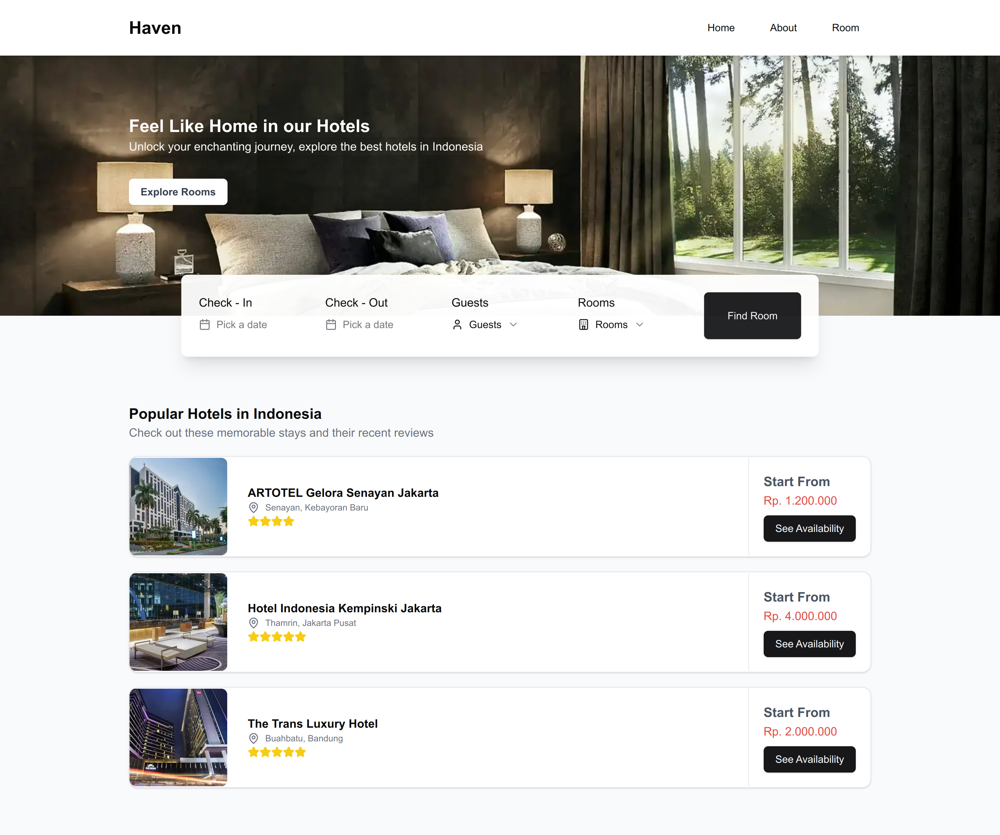

# Haven Booking System

Haven is a streamlined hotel booking application designed to simplify the process of reserving accommodations for travelers while providing hotels with a robust system to manage bookings and customer data efficiently.

## Features

- Booking Hotel
- Select Room Type

## Tech Stack

- Frontend: [Next.js](https://nextjs.org/)
- Backend: [Golang](https://go.dev/)
- Database: [MySQL](https://www.mysql.com/)
- Containerization: [Docker](https://www.docker.com/)

## Getting Started

### Prerequisites

- [Bun (1.1.28+)](https://bun.sh/)
- [Nodejs (1.1.28+)](https://nodejs.org/en)
- [Make](https://www.gnu.org/software/make/)
- [Air](https://github.com/air-verse/air) (Optional: If you want to run the server on development mode)
- [Docker](https://www.docker.com/) (Optional: If you want to run the application in a container)

### Installation

1. Clone the repository
2. Run `touch .env` to create a new `.env` file
3. Open the `.env` file and add the following variables:

```bash
DB_HOST: "localhost" # your database host
DB_USER: "haven" # your database user
DB_PASSWORD: "haven" # your database password
DB_NAME: "haven" # your database name
DB_PORT: 3306 # your database port
DB_SSLMODE: disable # your database ssl mode
DB_TIMEZONE: "Asia/Jakarta" # your database timezone
```

4. Run `cd server && touch .env` from server folder and add the following variables:

```bash
DB_HOST: "localhost" # your database host
DB_USER: "haven" # your database user
DB_PASSWORD: "haven" # your database password
DB_NAME: "haven" # your database name
DB_PORT: 3306 # your database port
DB_SSLMODE: disable # your database ssl mode
DB_TIMEZONE: "Asia/Jakarta" # your database timezone
```

5. Run `make run` to start the server on port `5000`.
6. Run `cd client && touch .env` to create a new `.env` file
7. Open the `.env` from client folder and add the following variables:

```bash
NEXT_PUBLIC_API_URL="http:#localhost:5000" # your api url
```

8. Run `bun install && bun run build && bun run start` to start the client on port `3000`.
9. Then open the browser `http://localhost:3000`

## Run on Docker

1. Make sure docker is already installed on your machine.
2. Make sure you don't have port `5000`, `3000` and `3306` already in use.
3. Run `docker-compose up -d` to start the application.
4. Then open the browser `http://localhost:3000`

## Screenshots




## TODO

- [ ] Add Authentication
- [ ] Add User Management
- [ ] Add Room Management
- [ ] Add Booking Management
- [ ] Add Notification
- [ ] Add Error Handling
- [ ] Add Dashboard for hotels and room management
- [ ] Add Payment
